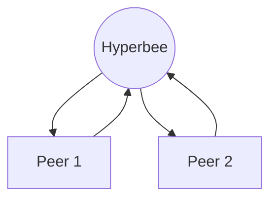
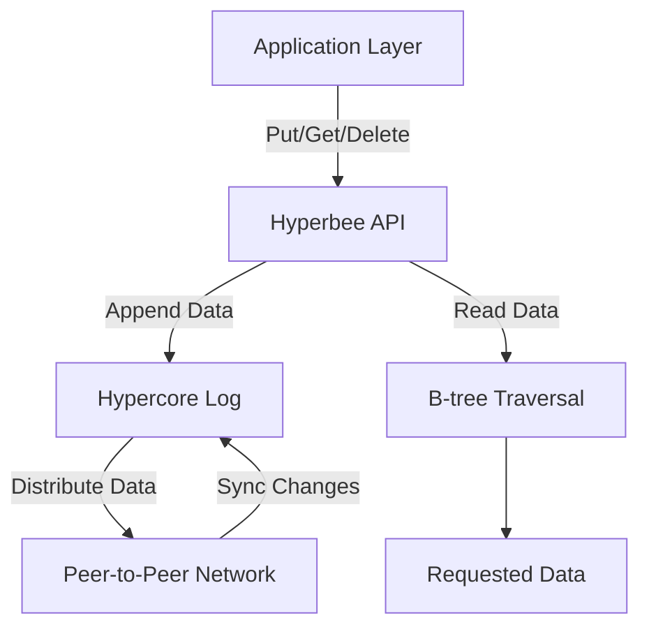

# Peer knowledge

```mermaid
graph TD
    Center((Hyperbee)) --> Peer1[Peer 1]
    Peer1 --> Center
    Center --> Peer2[Peer 2]
    Peer2 --> Center

```

```mermaid
flowchart TD
    A[Application Layer] -->|Put/Get/Delete| B[Hyperbee API]
    B -->|Append Data| C[Hypercore Log]
    C -->|Distribute Data| D[Peer-to-Peer Network]
    D -->|Sync Changes| C
    B -->|Read Data| E[B-tree Traversal]
    E --> F[Requested Data]

```
